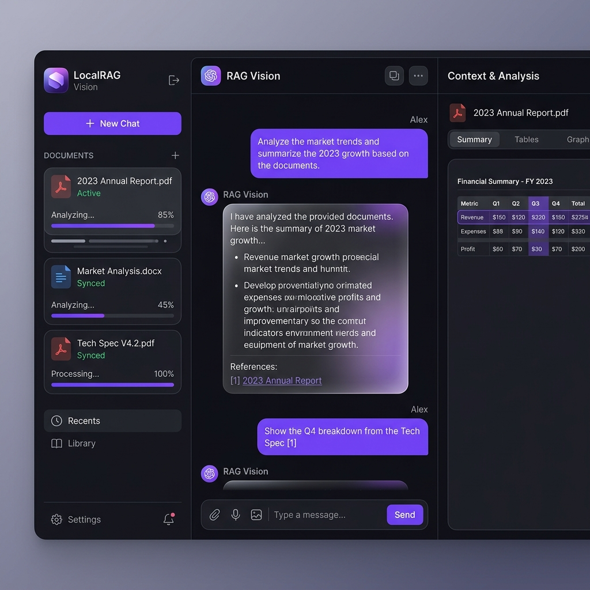

# LocalRAG Vision 🌌

**LocalRAG Vision** is a state-of-the-art, local-first Multimodal Knowledge Assistant designed for absolute data sovereignty. Built with a service-oriented architecture, it enables high-fidelity document intelligence using advanced structural extraction and hybrid retrieval.



## 🚀 Key Features (Phase 1)
- **Structural Extraction**: Powered by **Docling**, preserving headers, tables, and hierarchies from multi-format uploads.
- **Hybrid Retrieval Engine**: Robust search logic combining **BAAI/bge-small-en-v1.5** vectors with Full-Text Search (FTS) via **LanceDB**.
- **Streaming RAG**: Real-time AI responses using **Ollama** (Mistral/Llama 3) with full citation support.
- **Premium Glassmorphism UI**: High-fidelity dashboard built with **Next.js 16**, **React 19**, and **Tailwind 4**.
- **Privacy First**: 100% local processing; zero data leaves your machine.

## 🛠 Tech Stack (2026 Standard)
- **Frontend**: Next.js 16 (Turbopack), React 19, Tailwind CSS 4, Lucide Icons.
- **Backend**: FastAPI (Python 3.12), Celery, Redis.
- **Storage**: MinIO (S3 Compatible), LanceDB (Multimodal Vector Store).
- **Inference**: Ollama (Local LLM), Docling (Document Parsing).
- **Quality**: PyTest (Backend), Vitest + React Testing Library (Frontend).

## 📂 Project Structure
- `backend/`: FastAPI application, worker tasks, and RAG services.
- `frontend/`: Next.js dashboard and streaming interface.
- `docs/`: LLD, PRD, and UX specifications.
- `agent_docs/`: (Internal) Sprint plans and user stories.

## 🚀 Getting Started

### Prerequisites
- **Docker & Docker Compose**
- **[Ollama](https://ollama.com/) (Native Installation)**: For optimal performance and GPU (Metal) acceleration on macOS, Ollama should run natively on the host machine.

### Setup & Run

1. **Configure Native Ollama**:
   To allow Docker containers to communicate with your host's Ollama, set the following environment variable and restart the Ollama application:
   ```bash
   launchctl setenv OLLAMA_HOST "0.0.0.0"
   ```

2. **Pull Required Models**:
   ```bash
   ollama pull mistral
   ollama pull llava
   ```

3. **Start LocalRAG Infrastructure**:
   ```bash
   ./rag.sh up
   ```

4. **Access**:
   - **Main Dashboard**: [http://localhost:3000](http://localhost:3000) (Unified Entry)
   - **API Docs**: [http://localhost:3000/api/docs](http://localhost:3000/api/docs)
   - **MinIO Console**: [http://localhost:9001](http://localhost:9001)

## 🧪 Testing
Run the full quality suite:
```bash
# Backend Tests
./rag.sh backend pytest

# Frontend Tests
./rag.sh frontend npm test
```

---
*Built with ❤️ using the Antigravity BMAD Framework.*
