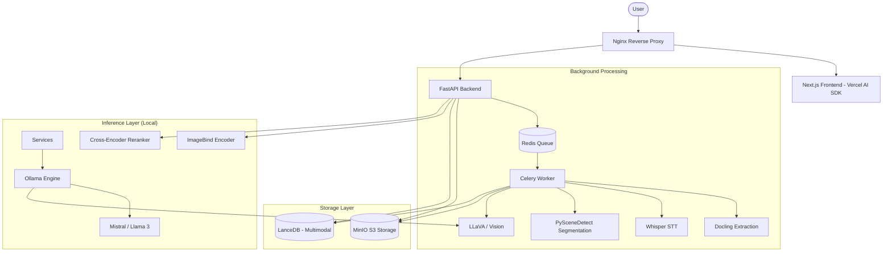

# Low-Level Design: LocalRAG Vision 🏗️

**Author**: Winston (Architect)
**Status**: Final (Merged)
**Date**: 2026-05-08

## 1. System Architecture (Microservices)
The system is designed for single-node GPU (min. RTX 3090/4090) or isolated on-premise infrastructure.

## 2. Technical Stack & Components

| Component | Technology | Role |
| :--- | :--- | :--- |
| **Inference Engine** | **Ollama (Native)** | Host-based engine for Mistral and LLaVA. Connected via `host-gateway` for GPU (Metal) acceleration. |
| **Orchestration** | **LangChain / LlamaIndex** | Workflow management, agents, and conversational memory. |
| **API Framework** | **FastAPI** | Async processing for ingestion and real-time streaming. |
| **Vector Store** | **LanceDB** | Optimized for video and multimodal columnar storage. |
| **Multimodal Encoder**| **ImageBind** | Unified mapping of text, image, and audio to shared vector space. |
| **STT Engine** | **Whisper** | State-of-the-art Speech-to-Text and speaker diarization. |
| **Task Queue** | **Celery + Redis** | Background processing for heavy document parsing (Docling). |
| **Object Store** | **MinIO** | S3-compatible storage for raw assets and video frames. |

## 3. Specialized Retrieval Strategies

### 3.1. Late Chunking Implementation
To preserve precision over long contexts, embeddings are generated for the full document before segmentation. This ensures each chunk carries the semantic signal of the entire document.

### 3.2. SceneRAG (Silence-Aware Refinement)
Video data is segmented into narratively coherent scenes using:
- **ASR Transcripts**: Temporal anchoring of dialogue.
- **Visual Adjacency**: Detecting scene transitions in silent segments.
- **Knowledge Graph**: Representing temporal relationships between scenes for context-aware video search.

### 3.3. Parent-Document Retrieval
Granular chunks are used for initial semantic lookup (Precision), but the full "Parent" context (paragraph or section) is retrieved for the LLM prompt (Coherence) to minimize interpretative errors.

## 4. Data Model & API Contracts

### 4.1. LanceDB Schema (`knowledge_base`)
| Field | Type | Description |
| :--- | :--- | :--- |
| `id` | string | Unique block identifier. |
| `vector` | vector(384) | Semantic embedding (e.g., BAAI/bge-small-en-v1.5). |
| `text` | string | Markdown content (Full-Text Search enabled). |
| `metadata` | json | `{ file: str, modality: "text" | "video", start_time: float, end_time: float }` |

### 4.2. API Endpoints
- **`POST /api/v1/ingest/upload`**:
  - Input: `multipart/form-data` (file).
  - Output: `{ task_id: string }`.
- **`GET /api/v1/ingest/status/{task_id}`**:
  - Output: `{ id: str, filename: str, status: "pending" | "completed" | "failed", created_at: str }`.
- **`POST /api/v1/search/query`**:
  - Input: `{ query: string, top_k: int }`.
  - Output: `{ results: List[SearchResult] }` where SearchResult includes `text` and `citations`.

## 5. Quality Gates & Testing

### 5.1. Backend Testing (PyTest)
- Unit tests for Services (Storage, Extraction, Indexing, Search, Chat).
- Integration tests for API endpoints.

### 5.2. Frontend Testing (Vitest)
- Component testing with React Testing Library.
- JSDOM environment for browser simulation.
- Mocking for AI streaming and Lucide icons.

## 6. Security & Isolation
- **Network Isolation**: 100% local processing with zero external API dependencies.
- **PII Filtering**: Integrated redaction layer before data enters the vector store.
- **Encryption**: SQLite/Redis session data is encrypted at rest using local master keys.

## 7. Architecture Decision Records (ADRs)

### ADR-002: Speed-First Multimodal Indexing
- **Status**: Accepted
- **Context**: Video processing is resource-intensive. Analyzing every frame would lead to unacceptably high latency on local hardware.
- **Decision**: We use a **"Keyframe-to-Narrative"** strategy. We segment videos using PySceneDetect (CPU-efficient) and only describe the 1st frame of each scene plus periodic samples for long scenes.
- **Alternatives Considered**:
  - Real-time frame analysis (Too slow).
  - Pure transcript-based RAG (Lossy for visual demonstrations).
- **Consequences**: Fast ingestion with granular visual context, but may miss sub-second visual events.
